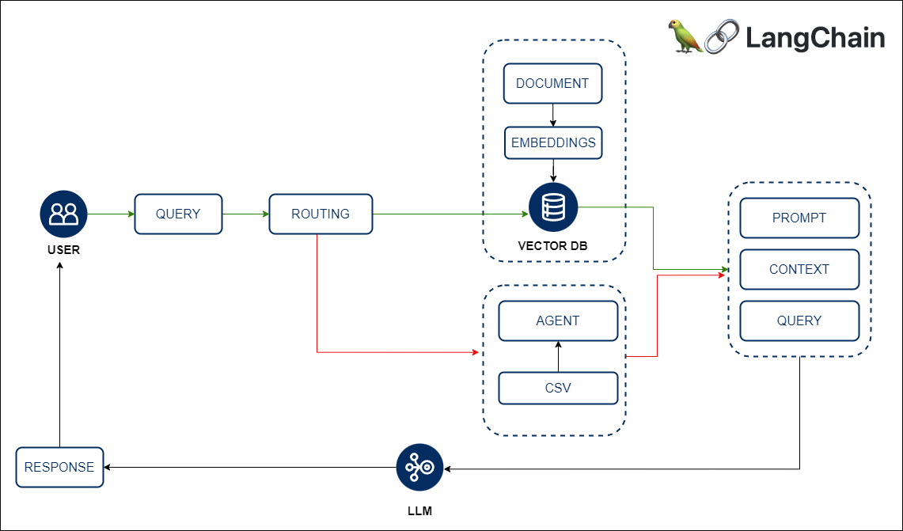

<h1 align="center">RAG Application With Python Agent</h1>

[](https://www.python.org)

[](https://github.com/pre-commit/pre-commit)


<p align="center">
  <a href="#key-features">Key Features</a> •
  <a href="#how-to-use">How To Use</a> •
  <a href="#download">Download</a> •
  <a href="#credits">Credits</a> •
  <a href="#related">Related</a> •
  <a href="#license">License</a>
</p>


## Key Features

* LLM Model agnostic approach 
  - Opensource models available in Huggingface are used in this project: google flan and mistralai
* Advanced routing model is included
  - The user query will be sent to two different chain models in order to do multi task. It can answer conversational question answering and can retrieve any answer from a csv file using pandas agent
* Pandas Agent is included  
* Chat History aware question answering application
* Cross platform
  - Windows, macOS and Linux ready.

## How To Use

To clone and run this application, you'll need [Git](https://git-scm.com), [Python](https://www.python.org/) and [CUDA](https://developer.nvidia.com/cuda-toolkit) installed on your computer. From your command line:

```bash
# Clone this repository
$ git clone https://github.com/Rifat1493/LLM-Langchain.git

# Go into the repository
$ cd LLM-Langchain

# Install pipenv
$ pip install pipenv

# Install all the dependency from Pipfile

$ pipenv install

```
After that you can run the `main.py` to use our console based application and ask anything about your document


``` bash

$ python main.py

```


## License

MIT


